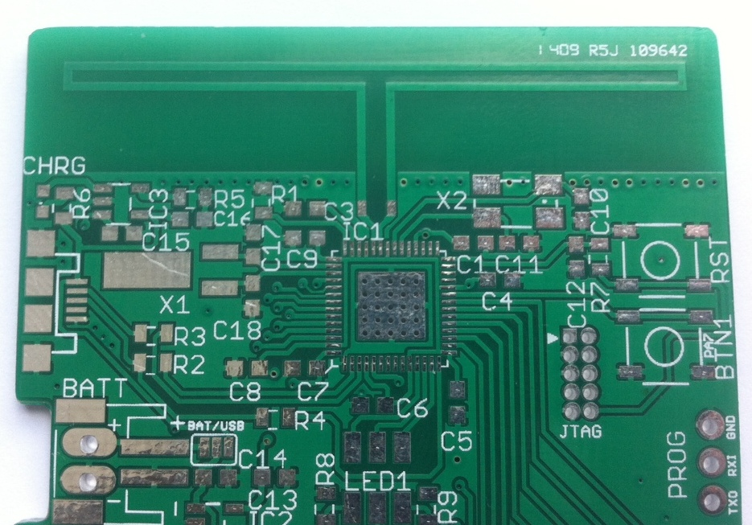

2.4GHz Folded Dipole PCB Antenna Footprint
==============

This is an **Eagle** library that holds a footprint for a 2.4GHz folded dipole PCB antenna.

It was drawn according to the Texas Instruments Design Note 004 (DN004 - [swra118.pdf](http://www.ti.com/lit/swra118)).

This design has been confirmed working, but is **not** ready for high volume production. It works great on my current prototype but hasn't been measured or verified in any other way. Right now the quality seems to be similar to a standard chip antenna - or better.

The folded dipole means you probably won't need a matching circuit or balun in your design and you can directly connect this to your radio / SoC.

Size: +- 45 mm x 10 mm

Use and known errors
------------
There are 2 exposed pads on the bottom of the footprint. this is a result of Eagle not allowing you to have pads covered with solder mask without generating a DRC error. You can cover them and ignore the errors.

Make sure you have a good ground plane alongside the bottom of the antenna (use plenty of vias). See DN004 for further details about PCB layout.

Example implementation with the TI CC2538:

If you use or improve this design, please let me know, post an issue or pull-request. I want to see how you improve this footprint and add a couple more example implementation pictures.

License
-------
**This hardware project is released under the [Creative Commons Share-alike 4.0 International](http://creativecommons.org/licenses/by-sa/4.0/) license.**

(C) Jelmer Tiete - <jelmer@tiete.be>